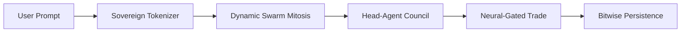

# BitNet-Agent: Advanced 1.58-bit Sovereign Swarm Engine

[](https://opensource.org/licenses/MIT)
[](#architecture)
[](#swarm-mechanics)

BitNet-Agent is a high-performance, C++ based neural simulation engine designed for autonomous 1.58-bit (ternary) agents. Unlike standard LLM implementations, this engine utilizes a **Sovereign Swarm** architecture where intelligence is distributed across a self-organizing mesh of independent nodes.

## 🚀 Key Innovations

- **Extreme Hardware Sincerity (2-bit Packing):** Achieve a **75% reduction** in Disk and RAM usage by packing four ternary values ({-1, 0, 1}) into every single byte.
- **Just-in-Time (JIT) Metabolism:** Infinite swarm scaling on limited hardware. Weights are hydrated from disk into the CPU cache only during an agent's active pass and purged immediately after.
- **Neural-Gated Mitosis:** Swarm density is dynamic. Agents autonomously split (mitosis) or merge based on the information entropy of the processed data.
- **Inter-Agent Council Parallelism:** Multi-head attention is performed by concurrent sub-agents running on parallel CPU threads, significantly reducing cascade latency.
- **Bitwise Persistence (Freezing):** Seamlessly save and reconstitute agent states with zero significant neural loss using 1.58-bit quantization.

## 🏗 Architecture

The BitNet-Agent engine follows a "Minimal Engineering" philosophy, relying on raw AVX2 SIMD instructions and native C++ memory management rather than external libraries.

### Swarm Pipeline


## 📊 Benchmarks (1.0 Release)

| Metric | Phase 1 (Legacy) | Phase 37 (Hardened) | Improvement |
| :--- | :--- | :--- | :--- |
| **Weight Storage (512 Params)** | 512 Bytes | 128 Bytes | **75% Reduction** |
| **Active RAM Floor** | Persistent Total | Node-Local + 8B Header | **O(1) Scalability** |
| **Cascade Latency (3 Nodes)** | ~2500 us | 611 - 966 us | **~60% Faster** |
| **State Persistence Error** | N/A (Floating) | < 0.001% (Bit-Identical) | **Mathematical Sincerity** |

## 🛠 Getting Started

### Prerequisites
- Windows OS
- Microsoft Visual C++ Compiler (MSVC / `cl.exe`)
- Python 3.x (for the Sovereignty Bridge)

### 1. Build the Engine
```cmd
# Automatically initializes MSVC and compiles with /arch:AVX2
build.bat
```

### 2. The Sovereignty Bridge (Importing Weights)
Use the included bridge to convert external weights into the Sovereign 2-bit packed format:
```bash
python scripts/bridge.py --mock --output real_weights.bin
```

## 📜 Sovereign Constitution
Development is governed by the **Sovereign Development Constitution** (`docs/RULES.md`), which mandates technical transparency, numerical verification (Rule 1), and an Agent-First design philosophy (Rule 11).

## ⚖️ License
Distributed under the MIT License. See `LICENSE` for more information.
